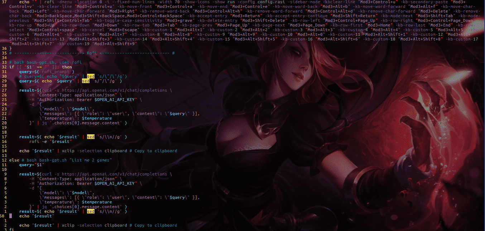

# gpt.sh 🚀

Welcome to **gpt.sh**, the hacker's way to call OpenAI's GPT models from Bash! This script allows you to easily query the OpenAI API from anywhere, using the latest and greatest GPT models available💻.

## Dependencies & Installation 📦
Before you can start using **gpt.sh**, you'll need to install a few *dependencies*. You can do this by running the following command:

`sudo apt-get update && sudo apt-get install -y rofi xclip curl jq && curl -s https://raw.githubusercontent.com/ilse-langnar/bashGPT/dev/gpt.sh > gpt.sh && chmod +x gpt.sh`

This will install the following packages:

**rofi**: A window switcher, application launcher and dmenu replacement 🚪

**xclip**: A command line interface to the X11 clipboard 📋

**curl**: A tool to transfer data from or to a server 🌐

**jq**: A lightweight and flexible command-line JSON processor 🔍

## Usage 🤖
There are two main ways to use **gpt.sh**: with a script and with a shortcut.

## Using **gpt.sh** with a script 📜
1) Download the **gpt.sh** file. 📥
2) Open the file and replace the default options (key, model and temperature) with your own. 🔑
3) Run the script by typing bash **gpt.sh** in your terminal like: `gpt.sh "List me the top 10 games of all time"`. 🖥️
4) That's it! **gpt.sh** will query the OpenAI API using your chosen model and temperature, and copy the generated text to your clipboard using xclip. 📋

## Using **gpt.sh** with i3wm 🐧

1) Download the **gpt.sh** file. 📥
2) Open the file and replace the default options (key, model and temperature) with your own. 🔑
3) Open your i3wm config file by typing nano ~/.config/i3/config in your terminal. 🖥️
4) Add the following line to your config file: `bindsym $mod+Shift+c exec bash gpt.sh` 📝
5) Save the config file and restart i3wm. ♻️
6) Press `$mod+Shift+c` to launch **gpt.sh**. 🚀

Now you can use **gpt.sh** from anywhere in **i3wm** by pressing `$mod+Shift+c` and generating awesome text with OpenAI's GPT models! 🤖

## Limitations 🚫
**gpt.sh** cannot handle double quotes very well. When you use double quotes in your input prompt, **gpt.sh** replaces them with backslashes, which may cause unexpected behavior. To avoid this issue, use single quotes in your input prompt instead.

Additionally, **gpt.sh** is dependent on several packages, including rofi, xclip, curl, and jq. If any of these packages are missing or outdated, **gpt.sh** may not function as expected. Therefore, it is important to make sure that all dependencies are properly installed and up-to-date before using gpt.sh.

👉 Note: The limitations mentioned above are subject to change as the script evolves over time. Please check the project's Github repository for the latest updates and known issues.

## Contributing 💪
If you find any issues with **gpt.sh** or want to contribute to the project, feel free to create an issue or a pull request on the Github repository. We welcome all contributions and suggestions! 🙏

## License 📄
gpt.sh is licensed under the MIT License. Use it, modify it, have fun with it! 😎
